# VPN Remote-Site (SSL-VPN) con FortiGate

## 🎥 Video demostrativo

**[Ver video en YouTube](https://www.youtube.com/watch?v=03Dq_PRPTKk)**

> Autor: **Erick Abdiel Laureano Martinez** | Matrícula: **2025-0846** | Asignatura: Seguridad de Redes

---

## Tabla de contenido
1. [Propósito del laboratorio](#propósito-del-laboratorio)
2. [Diagrama de la topología](#diagrama-de-la-topología)
3. [Direccionamiento IP](#direccionamiento-ip)
4. [Configuración de red](#configuración-de-red)
5. [Servidor web y SSH](#servidor-web-y-ssh)
6. [Usuarios: DHCP y traceroute](#usuarios-dhcp-y-traceroute)
7. [Acceso web sin VPN](#acceso-web-sin-vpn)
8. [Configuración de la VPN SSL](#configuración-de-la-vpn-ssl)
9. [Acceso SSH mediante VPN](#acceso-ssh-mediante-vpn)
10. [Evidencias y logs](#evidencias-y-logs)
11. [Running-configs y scripts](#running-configs-y-scripts)

---

## Propósito del laboratorio

Demostrar una VPN de acceso remoto (cliente a sitio) con un FortiGate, configurada completamente por la GUI. Los objetivos son:

- El usuario **accede al servidor web sin necesidad de VPN**.
- El usuario **accede al servidor por SSH únicamente a través de la VPN**.

La topología incluye un equipo de red Cisco (R2) con la VLAN 10 de usuarios y DHCP, un ISP con IPs públicas, un servidor web (/28) y un FortiGate que publica el web y termina la VPN SSL.

---

## Diagrama de la topología

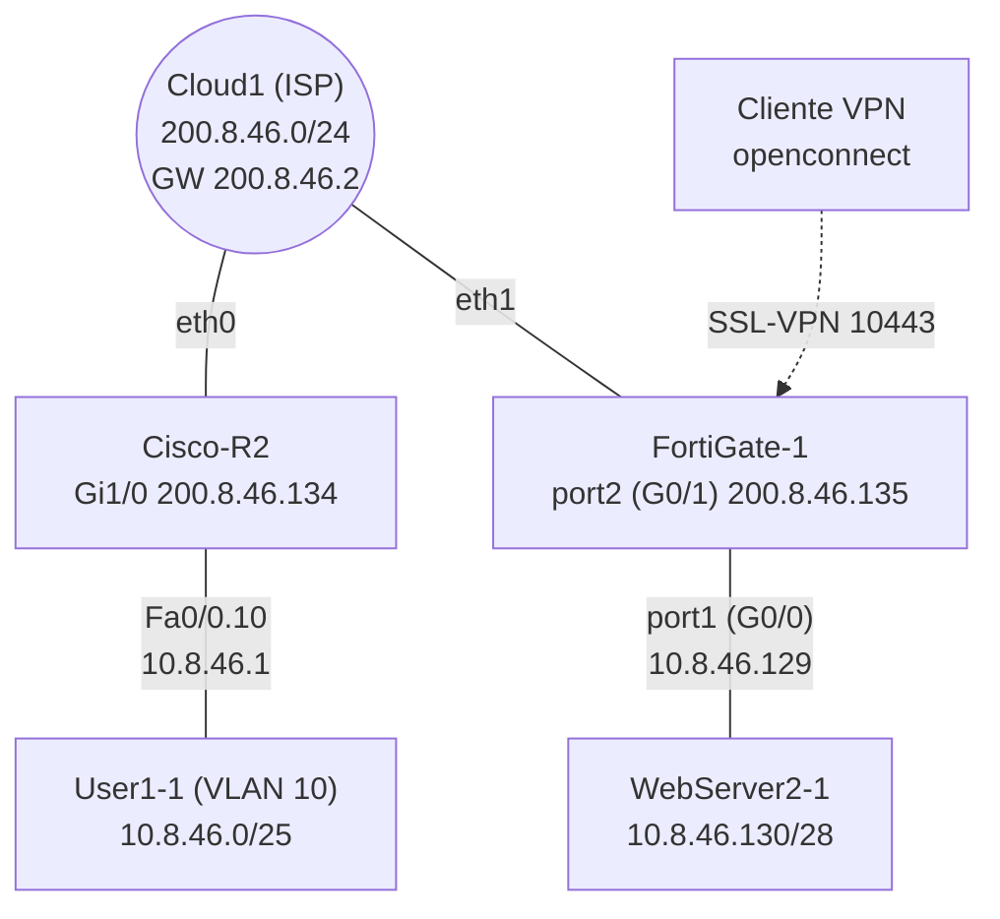

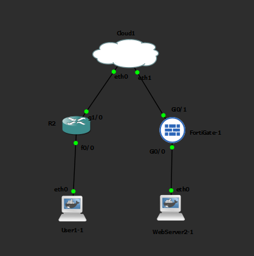

---

## Direccionamiento IP

| Dispositivo | Interfaz | Dirección | Notas |
|---|---|---|---|
| FortiGate | port2 (WAN) | 200.8.46.135/24 | Hacia el ISP |
| FortiGate | port1 (LAN servidor) | 10.8.46.129/28 | Gateway del servidor |
| Cisco-R2 | Gi1/0 | 200.8.46.134 | Hacia el ISP / FortiGate |
| Cisco-R2 | Fa0/0.10 | 10.8.46.1/25 | Gateway VLAN 10 de usuarios |
| Servidor web | eth0 | 10.8.46.130/28 | Apache + SSH |
| ISP | | 200.8.46.2 | Gateway por defecto |
| Cliente VPN | túnel | 10.8.46.200 | Asignada por la SSL-VPN |

---

## Configuración de red

### Interfaces del FortiGate
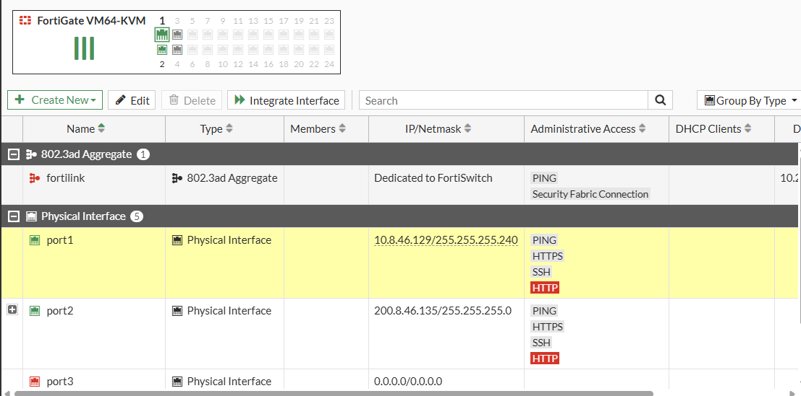

### Rutas estáticas
Ruta por defecto hacia el ISP (200.8.46.2) y ruta a la red de usuarios (10.8.46.0/25) vía R2 (200.8.46.134).

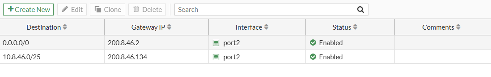

### Cisco-R2
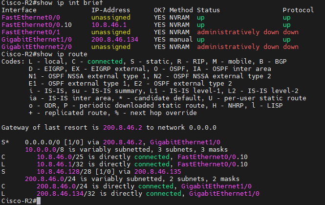

Subinterfaz de la VLAN 10:

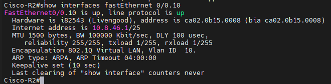

---

## Servidor web y SSH

El servidor ejecuta Apache (DVWA) y OpenSSH.

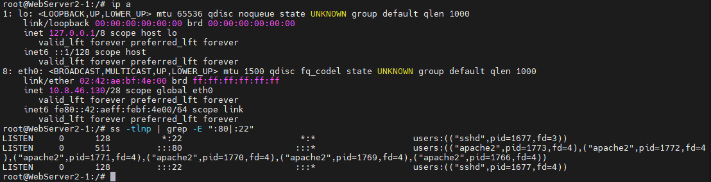

---

## Usuarios: DHCP y traceroute

Los usuarios están en la VLAN 10 y obtienen IP por DHCP.

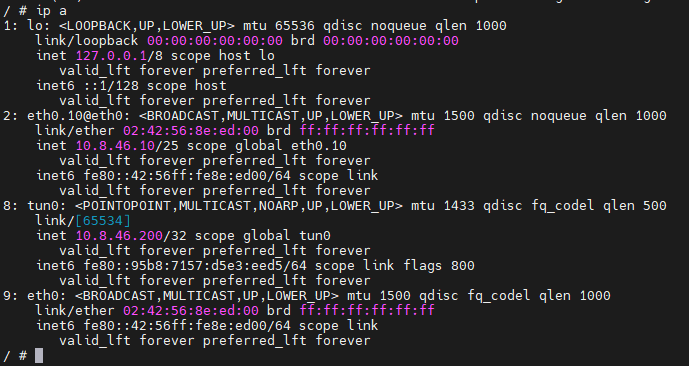

Traceroute hacia el servidor (R2 → FortiGate → servidor):

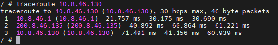

---

## Acceso web sin VPN

El web se publica con un Virtual IP (DNAT) y una política de firewall en el FortiGate, por lo que el acceso no requiere VPN.

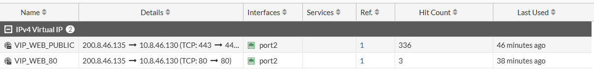

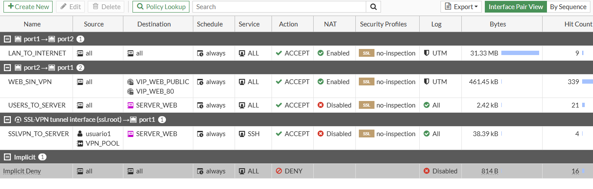

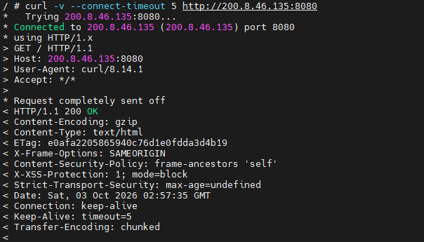

El SSH sin VPN no está permitido:

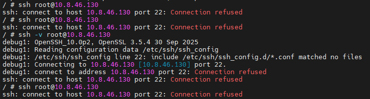

---

## Configuración de la VPN SSL

- Interfaz de escucha: **port2**
- Puerto: **10443**
- Portal: **full-access** (modo túnel)
- Usuario: **usuario1**
- Pool de direcciones: **VPN_POOL**

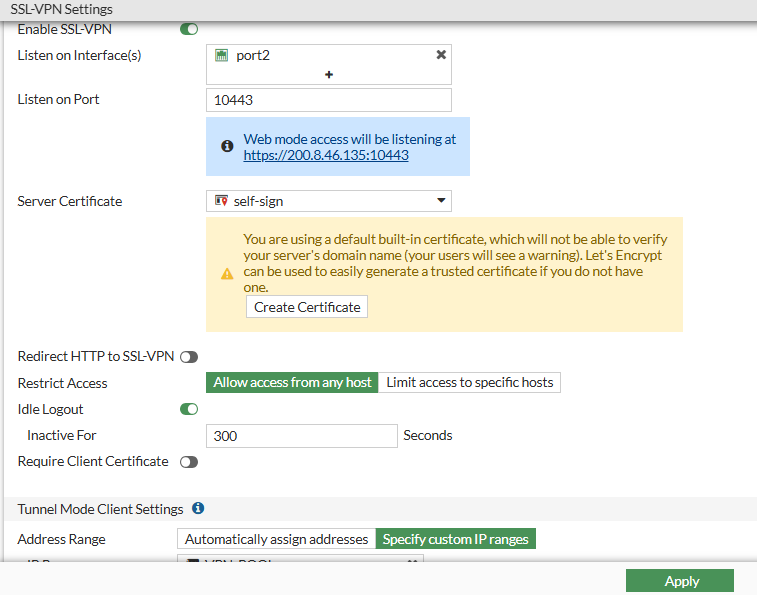

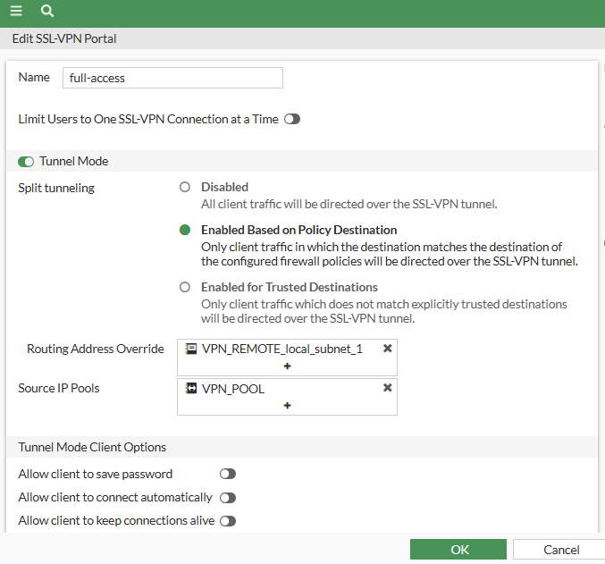

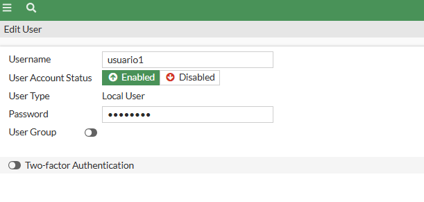

### Política que permite SSH solo por la VPN
`SSLVPN_TO_SERVER`: ssl.root → port1, origen VPN_POOL + usuario1, destino SERVER_WEB, servicio SSH.

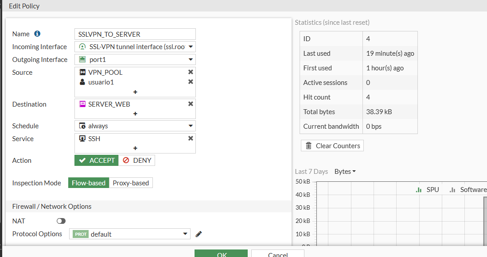

---

## Acceso SSH mediante VPN

Conexión desde el cliente con `openconnect`:

```bash
OPENSSL_CONF=/tmp/o.cnf openconnect -b --protocol=fortinet \
  https://200.8.46.135:10443 --user=usuario1 \
  --servercert pin-sha256:<HUELLA_DEL_CERTIFICADO>
ssh root@10.8.46.130
```

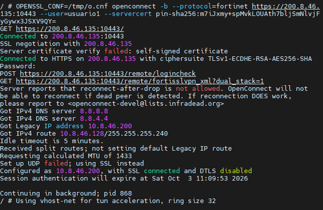
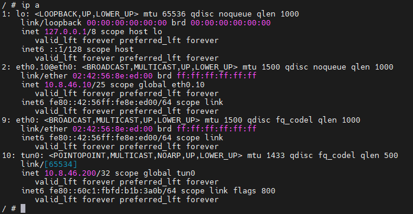

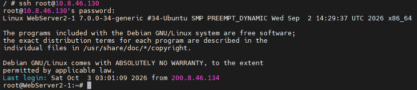

> **Nota:** el cliente usa OpenSSL 3.5, que envía grupos post-cuánticos que el FortiGate no negocia. El archivo `scripts/o.cnf` limita TLS a 1.2 y a los grupos X25519/secp256r1.

---

## Evidencias y logs

Usuario conectado en el monitor de SSL-VPN:

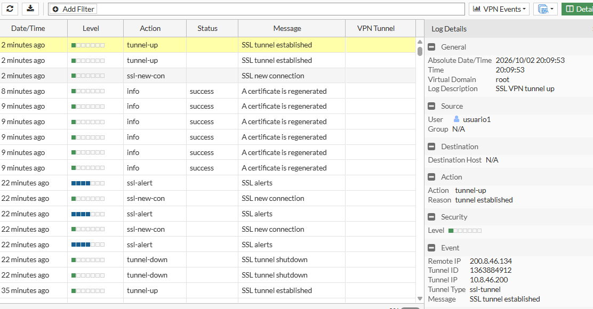
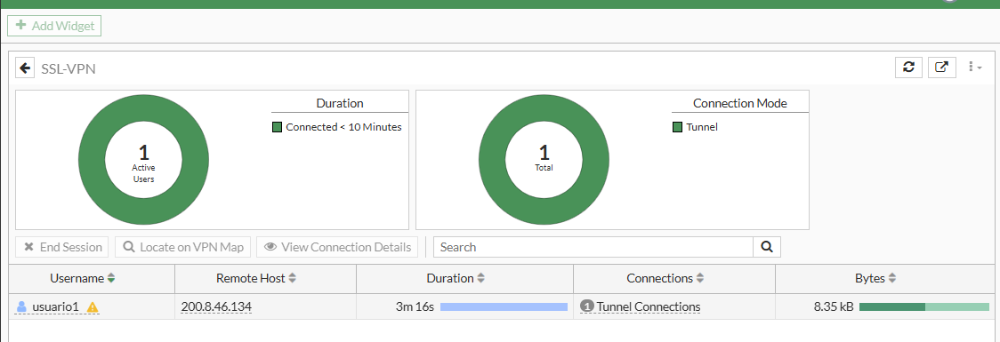

Tráfico aceptado (HTTP sin VPN y SSH por VPN):

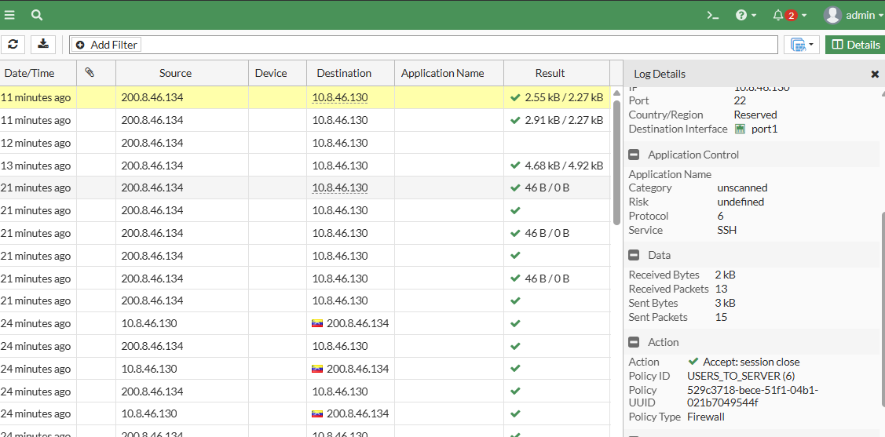

---

## Running-configs y scripts

```
├── README.md
├── configs/
│   ├── fortigate-running-config.conf
│   └── cisco-r2-running-config.txt
├── scripts/
│   ├── o.cnf                      # TLS 1.2 para openconnect
│   ├── conectar-vpn.sh            # Conexión openconnect + ssh
│   ├── webserver-network.txt      # Config de red del Docker (Edit config)
│   └── webserver-ssh.sh           # Instalación y arranque de SSH
└── img/
```

- [FortiGate running-config](configs/fortigate-running-config.conf)
- [Cisco-R2 running-config](configs/cisco-r2-running-config.txt)
- [Scripts](scripts/)

> Las contraseñas, los hashes y las claves precompartidas fueron removidos de las configuraciones.
